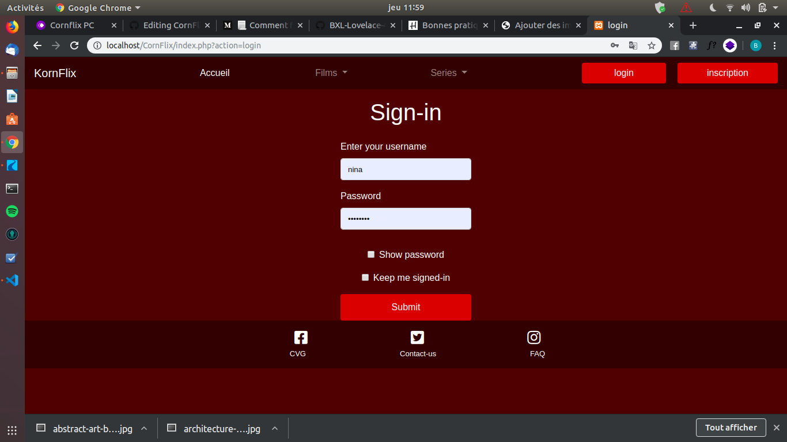
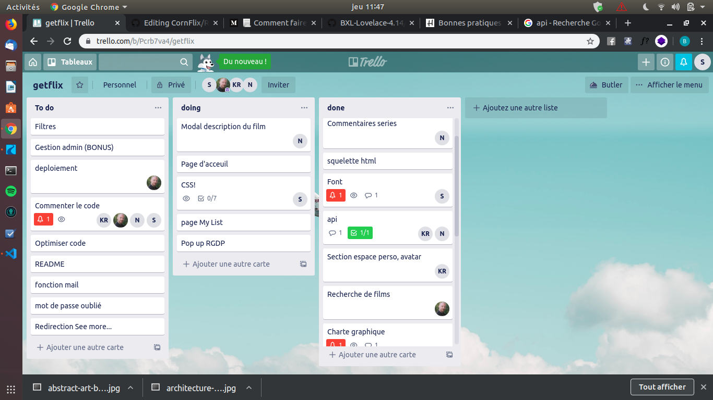
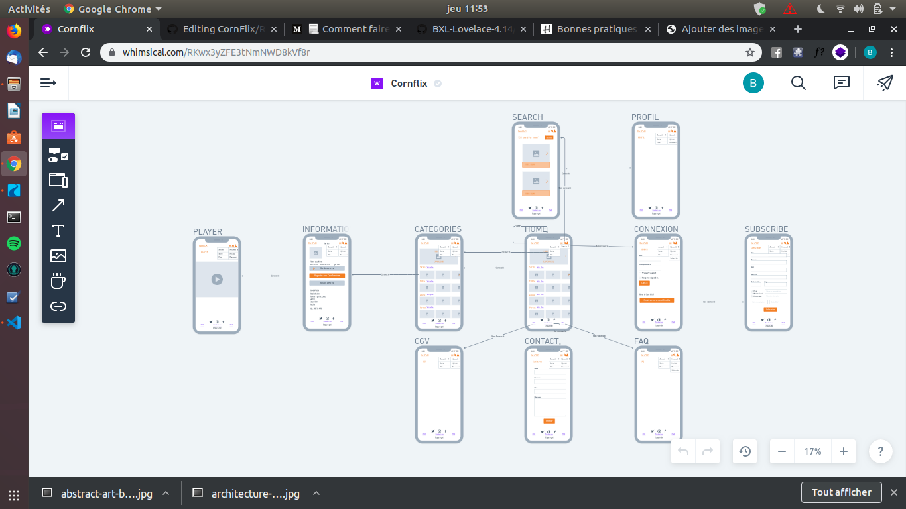
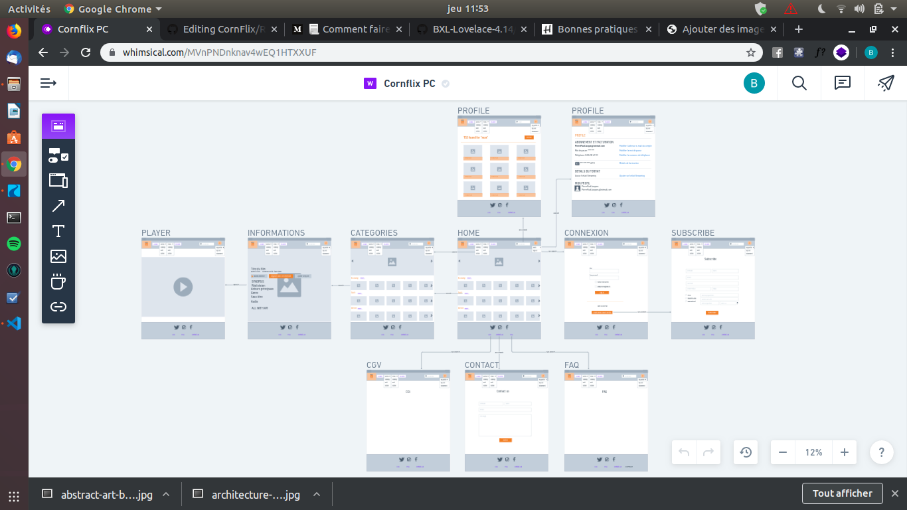

# CornFlix
  Réalisation d'un site streaming  
   
  
# Qui a fait ce projet ?
  Nous sommes une petite équipe composé de 4 codeurs:
  
  Bunyamin Serbest -> https://github.com/Bunyaminserbest ;  
  Mike Hanon -> https://github.com/MikeHanon ;  
  Nicolas Tassin -> https://github.com/NicolasTassin ;  
  Kevin Ryckaert -> https://github.com/KevinRyckaert ;  
  
# Quel type de projet ?
  Dans le cadre de notre formation chez Becode,nous avons **réaliser un site de Streaming**.  
  Le but est d’afficher un catalogue de films, une navbar, un header, l'outil de recherches, différentes
  catégories de vidéos… Et rendre tout ceci **fonctionelle**.  
  Nous nous somme inspiré de différents sites streaming (comme Netflix,Primevideo,...) pour pouvoir le réaliser.
  
# Quand et Combien de temps?
  Nous avons commencer ce projet le **21/10/2019** et terminer le **31/10/2019**.  
  Un **délais de 10 jours** nous a été imposé par notre Coach.  
  Notre équipe a passé grosso modo 7h par jours.  
  
# Où ?
  Comme expliqué précedement tout ceci se fait dans le cadre de notre formation, dans les locaux de **BeCentral**.
  
  
# Langages et frameworks
  - HTML5/CSS, bootstrap  
  - JavaScript  
  - Php, Jquery  
  - MySQL, PHPmyAdmin  
  - A.P.I.(movieDB) => interface de programmation
  
# Organisation.

  1. **Briefing** chaque matin dès le 1er jour pour faire une mise à jour de nos tâche journalière chasser les doutes,
     les craintes, les peurs, les incompréhensions, pour favoriser une pleine confiance durant les 10 jours.  
       
  2. Utilisation de **trello** (outil de gestion de projet en ligne) pour définir, et répartir les tâches et surtout suivre
     l'avancement du projet.    
        
  
  3. Utilisation de **whimsical** pour créer la maquette de notre projet, ce qui nous a permis de mieux discerner
     les differentes parties de notre site streaming.  
        
        
     
  4. Repartition des tache de manière à ce que tout le monde sort de sa zone de confort.
  
